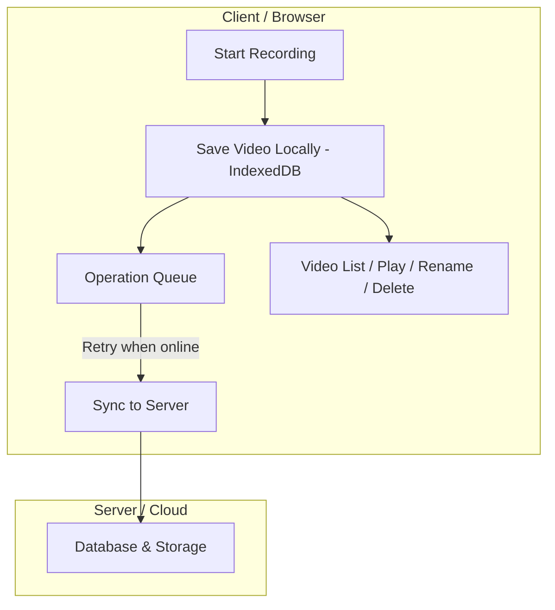

# Video web application

## Background

A mini project done across a few weeks to play around with web videos.   
This is a simple application that streams video from the user's webcam and provides a button to start and stop recording. When recording stops, the recorded video should be saved locally on the user's device. Then, the application will automatically upload the recorded video to a server once connectivity is available,
The application displays the upload status and progress. Lastly, the application shows a list of recorded videos for the user to perform video playback, renaming and deletion.

### Functional requirements
- [ ] User can click a start recording button. Starts video recording.
- [ ] User can click a stop recording button. Stops video recording.
- [ ] User uploads the video automatically after video recording is ended.
- [ ] User can see upload status (Synced, Pending/Uploading, Failed).
- [ ] User can see upload progress.
- [ ] User can see past recorded videos in a list.
- [ ] User can perform video playback.
- [ ] User can rename video.
- [ ] User can delete video.
### Non-Functional requirements
- [ ] Keep project scope tightly controlled to one or two weeks of work.
- [ ] Prioritize availability under network disruption.
- [ ] Must operate offline and later sync when online.

## Getting started

<ins>Environment tested</ins>  
Windows 10 OS.  
python 3.13.3.  
uv 0.8.13.  
npm 11.5.1.  

See `package.json` and `pyproject.toml` for more details.

This README.md assumes knowledge of npm and `uv`. In case, you don't, here are some helpful links for installation.  
- https://docs.npmjs.com/downloading-and-installing-node-js-and-npm  
- https://docs.astral.sh/uv/getting-started/installation/  

### Installation

#### Setting up Google OAuth

1. Go to [Google Cloud Console](https://console.cloud.google.com/)
2. Create a new project or select an existing one
3. Navigate to APIs & Services → OAuth consent screen and configure it
4. Go to Credentials → Create Credentials → OAuth client ID
5. Create an OAuth 2.0 Client ID:
   - Application type: Web application
   - Authorized JavaScript origins: 
     - `http://localhost:5173`
     - `http://127.0.0.1:5173`
     - (Add your production URL when deploying)
   - Authorized redirect URIs: 
     - `http://localhost:3000`
     - `http://127.0.0.1:3000`
     - (Add your production URL when deploying)
6. Copy the Client ID (for frontend) and Client Secret (for backend)
7. Add them to your `.env` files as shown in the installation instructions above
8. Restart your development server after updating `.env` files

#### Frontend
1. Navigate into frontend folder
```powershell
cd frontend
```

2. Install the node packages.
```powershell
npm install
```

3. If the .env file is not present. Create `.env` file in frontend folder
```
vim .env
```
Insert the following
```
VITE_API_URL=http://localhost:8000
VITE_GOOGLE_CLIENT_ID=your-google-client-id-here
SYNC_INTERVAL_MS=30000
RETRY_DELAY_MS=5000
HEALTH_CHECK_TIMEOUT=10000
```

#### Backend
1. Install the python dependencies
```powershell
uv sync
```

2. If the .env file is not present. Create `.env` file in backend_python folder
```
vim .env
```

Insert the following
```
PROJECT_NAME=backend_server
PROJECT_VERSION=0.1.0
LOG_LEVEL=INFO
HOST=127.0.0.1
DEBUG=false
SUPABASE_URL={secret}
SUPABASE_ANON_KEY={secret}
DATABASE_URL=postgresql+asyncpg://{session_pooler_connection_here}
ALLOWED_ORIGINS=http://localhost:5173
GOOGLE_CLIENT_ID=your-google-client-id-here
GOOGLE_CLIENT_SECRET=your-google-client-secret-here
JWT_SECRET_KEY=your-jwt-secret-key-change-this-in-production
```

### Running

Run frontend.
```powershell
cd frontend
npm run dev
```

Run backend.
```powershell
cd backend_python
uv run python main.py
```

## Features

This video web application provides a comprehensive solution for recording, managing, and syncing videos with the following key features:

### Video Recording
- **Webcam Recording**: Record videos directly from your webcam using the browser's MediaRecorder API
- **Real-time Preview**: Live video preview with mirror mode toggle during recording
- **Recording Timer**: Visual timer display showing recording duration
- **Format Support**: Records videos in WebM format

### Video Management
- **Local Storage**: All videos are stored locally in IndexedDB for instant access and offline functionality
- **Video Playback**: Play videos directly in the browser with a built-in video player
- **Rename Videos**: Rename video files with custom filenames
- **Delete Videos**: Delete individual videos or all videos at once
- **Video Metadata**: View video details including filename, size, duration, creation date, and sync status

### Cloud Synchronization
- **Offline-First Architecture**: Videos are saved locally first, then automatically synced to the cloud
- **Automatic Sync**: Background synchronization service automatically uploads videos to server if in online mode at the time of stop recording.
- **Manual Sync**: Trigger manual synchronization on demand
- **Upload Progress**: Upload progress tracking with percentage and file size indicators
- **Status Tracking**: Visual status indicators showing sync state (Queued, Uploading, Synced, Failed, Pending Sync)
- **Conflict Resolution**: Smart merging of local and server videos based on modification timestamps
- **Retry Mechanism**: Failed uploads remain in queue for retry when connection is restored

### Offline Support
- **Offline Mode**: Full functionality when offline - record, view, rename, and delete videos locally
- **Operation Queue**: Pending operations (uploads, renames, deletes) are queued and executed when connection is restored
- **Connection Status**: Visual indicator showing online/offline status
- **Pending Operations Counter**: Display of pending operations waiting to sync

### Authentication
The application uses **Google OAuth 2.0** for authentication. Users sign in with their Google account.

## Glance at tech involved
<ins>Frontend</ins>  
TypeScript, ReactJS, Tailwindcss, IndexedDB.   
<ins>Backend</ins>  
Python, FastAPI, SQLAlchemy, psycopg2, Supabase client library.  
<ins>Cloud</ins>  
Supabase S3 compatible object bucket for video storage. PostgreSQL for video records.  

## Architecture Overview

The application follows a modern, offline-first architecture with clear separation between frontend and backend components.



### Frontend Architecture (React + TypeScript)

**Technology Stack:**
- React with TypeScript for type-safe UI components
- Vite for fast development and building
- IndexedDB for local browser storage
- React hooks for state management

**Key Components:**

1. **VideoRecorder Component**: Handles webcam access and video recording using the MediaRecorder API. Records videos and saves them locally via the sync service.

2. **VideoList Component**: Displays all videos with their metadata, status indicators, and management actions (play, rename, delete). Shows upload progress and sync status.

3. **Sync Service** (`syncService.ts`): Core synchronization engine that:
   - Manages local-first video storage
   - Queues operations for offline scenarios
   - Handles bidirectional sync between local and server
   - Resolves conflicts using timestamp-based merging
   - Tracks upload progress and status

4. **Storage Layer** (`storage.ts`): IndexedDB wrapper that stores:
   - Video metadata and blob data
   - Pending operations queue (upload, rename, delete)
   - Upload progress tracking

5. **API Layer** (`videoApi.ts`): HTTP client for communicating with the backend REST API, handling video CRUD operations and file uploads with progress tracking.

**Data Flow:**
1. User records video → Saved to IndexedDB immediately
2. Operation queued for upload → Added to pending operations queue
3. Sync service processes queue → Uploads to backend when online
4. Backend stores metadata → Returns cloud path
5. Local record updated → Video marked as synced

### Backend Architecture (FastAPI + Python)

**Technology Stack:**
- FastAPI for RESTful API endpoints
- SQLAlchemy with async support for database operations
- PostgreSQL database (hosted on Supabase)
- Supabase Storage for video file storage
- Async/await patterns for concurrent request handling

**Key Components:**

1. **API Routes** (`routes/v1/videos.py`): REST endpoints for:
   - `GET /api/v1/videos` - List all videos
   - `GET /api/v1/videos/{id}` - Get specific video
   - `POST /api/v1/videos` - Create video record
   - `POST /api/v1/videos/{id}/upload` - Upload video file
   - `PATCH /api/v1/videos/{id}` - Update video (rename, status)
   - `DELETE /api/v1/videos/{id}` - Delete video and file

2. **Video Service** (`services/video.py`): Business logic layer handling video CRUD operations, status management, and database interactions.

3. **Supabase Storage Service** (`services/supabase.py`): Manages file uploads to Supabase Storage, handles bucket creation, and provides file storage operations.

4. **Database Models** (`models/video.py`): SQLAlchemy models defining the video schema with fields for metadata, upload status, timestamps, and cloud paths.

**Data Flow:**
1. Frontend creates video record → POST to `/api/v1/videos`
2. Backend creates database entry → Returns video with UUID
3. Frontend uploads file → POST to `/api/v1/videos/{id}/upload`
4. Backend uploads to Supabase Storage → Updates record with cloud path
5. Frontend fetches updated record → Video now has cloud_path for access

### Synchronization Strategy

The application uses an **offline-first** approach with eventual consistency:

- **Local-First**: All operations happen locally first, ensuring immediate feedback
- **Operation Queue**: Changes are queued when offline and processed when online
- **Bidirectional Sync**: On sync, the system:
  - Uploads local-only videos to server
  - Downloads server-only videos to local storage
  - Merges conflicts by comparing `last_modified` timestamps (newer wins)
- **Status Tracking**: Each video tracks separate status for local storage (`upload_status_private`) and cloud storage (`upload_status_cloud`)
- **Error Handling**: Failed operations remain in queue for retry, with visual indicators for user awareness

### Storage Architecture

- **Frontend**: IndexedDB stores video blobs and metadata locally
- **Backend Database**: PostgreSQL stores video metadata and references
- **File Storage**: Supabase Storage hosts actual video files, accessible via public URLs
- **Sync Queue**: IndexedDB stores pending operations that need to sync with server

This architecture ensures a responsive user experience with full offline functionality while maintaining data consistency across devices when online.

## Etc Notes
Check scripts for sql schema and commands used.  
Due to supabase free tier bucket limit of 50 MB per file, 500MB in total. Large videos (>=2:55 mins) cannot be uploaded.
